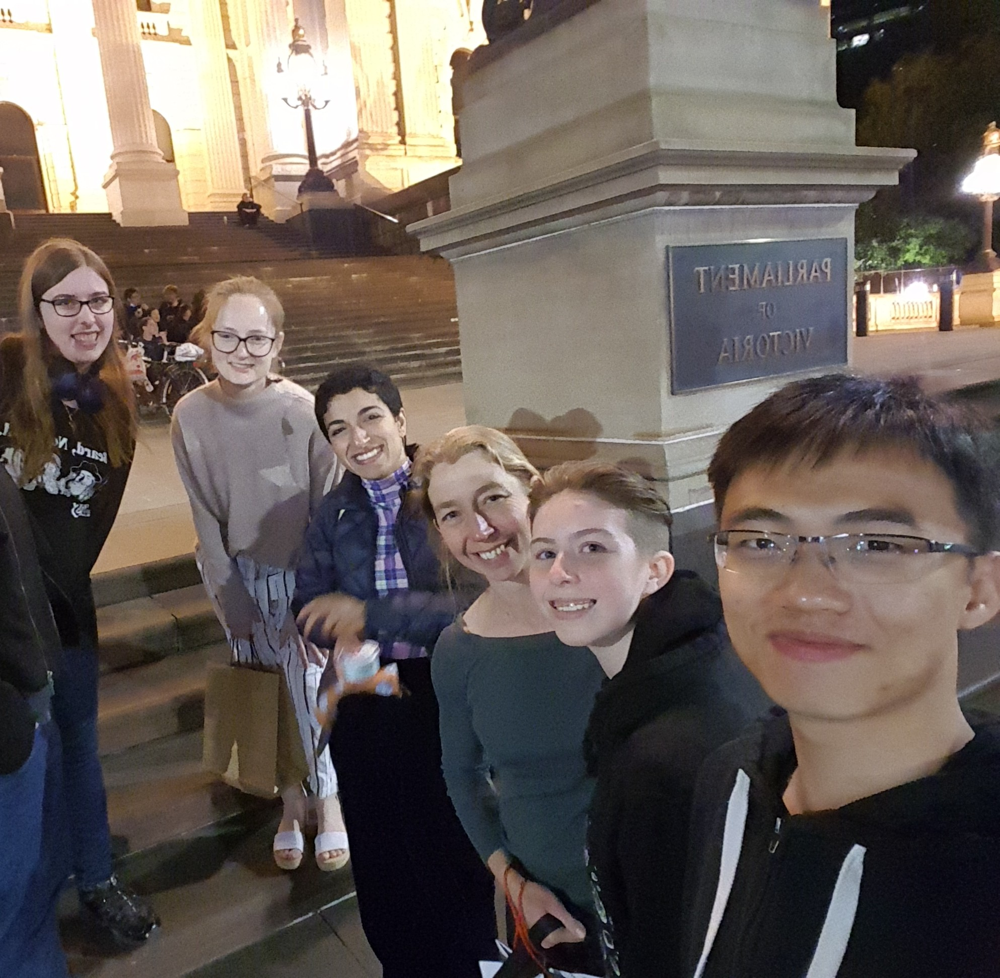

See the rendered docs [here](https://righttoaskorg.github.io/righttoask-docs/), participate in [Discussions]() or add comments at [HackMD](https://hackmd.io/@RightToAsk-Docs).

Code contributed to this project from 31 Jan 2022 will be copyright Democracy Developers and will be released under an open source license.

So far, we've had valuable contributions from [Andrew Conway](), [Ishan Goyal](https://github.com/Ishan27g), [Kipling](https://github.com/KipCrossing), [Chuanyuan Liu](https://github.com/ChuanyuanLiu), [Eleanor McMurtry](https://github.com/eleanor-em), [Lillian McCann](https://github.com/lillimc), [Hanna Navissi](https://github.com/hannanavissi), [Pedro Rosas](https://www.linkedin.com/in/pedro-rosas-ux) and [Miguel Wood](https://www.linkedin.com/in/migster/). The team is organised by Vanessa Teague - email me if you'd like to join.

If you're new to open source, you might like to read [this guide to getting started](https://www.digitalocean.com/community/tutorial_series/an-introduction-to-open-source).

