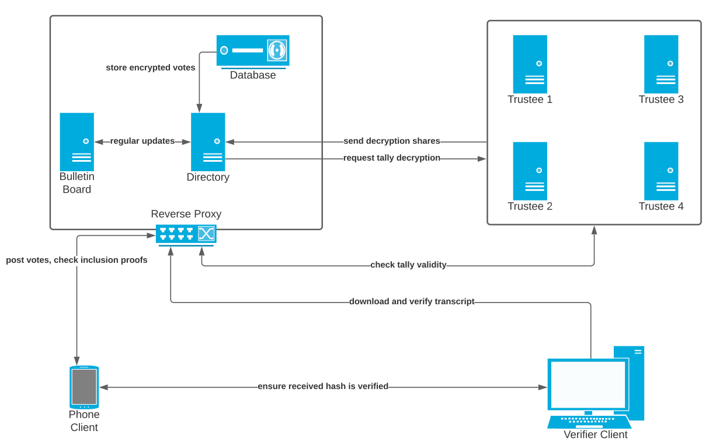

# API Brainstorm

## Overview

This document aims to initiate discussion regarding the APIs and data objects from a level of abstraction without diving into details. All analysis closely follows the [feature documentation](https://righttoaskorg.github.io/righttoask-docs/Features) such that all desired features are achievable using the API deisgn listed on this page. 

This document currently only discusses the communication between the phone client and the directory, as shown in diagram below. The directory handles all the GET and POST requests from the client, who can be either an MP or a member of the public. Specifying direct messaging will be deferred to the future.

[API.md](https://github.com/RightToAskOrg/righttoask-docs/blob/gh-pages/API.md) dives deeper into the API for voting and verifying the votes of a question.

We assume that all communications are encrypted using TLS.

## Registration

A user $(\text{userName}, \text{pubKey})$ registers him or herself by generating a key pair and submitting  $(\text{userName}, \text{pubKey})$ to the server. Optionally, they can include their (state or federal) electorate.  In principle, a key pair suffices for authentication.

For some accounts, including MPs and organisations, we wish to check that the user can receive email at a certain domain.  This allows, for example, for verification of emails of a government domain to verify the status of a government worker.
  For these kinds of accounts, the registering user also sends an  email address, to which the server sends a $PIN$.   Upon receving the $PIN$ the user would sign and submit $(\text{userName}, \text{PIN})$ to prove access and associate the public key with the  email. Now the user can use the private key to sign all communications to server.** 

**Question: is it helpful for backup/recovery for ordinary users if the server asks for a phone number and sends a $PIN$ to the number provided? Or likewise for email? **

To ensure annomity, we use a clever algorithm to only allow the decryption of aggregated votes $\Pi E(Pr_{auth}, vote_i) = E(Pr_{auth}, \sum_i vote_i)$ as  explained in [Election Guard](https://www.electionguard.vote/spec/0.95.0/1_Overview/#ballot-encryption). Here $Pr_{auth}$ is the election public key, for which the corresponding secret key is secret-shared among trustees using [Sharmir's Secret Sharing](https://en.wikipedia.org/wiki/Shamir's_Secret_Sharing#Shamir's_secret_sharing_scheme). 

## Syncing of data

What better way to hide your viewing history than storing the entire copy of the database? This approach is achievable thanks to wordlimits imposed on the questions, and the use of links to external multimedia. An attack that sniffs the traffic to external links is beyond the scope of this system.

Verification is only required for the viewing of data concerning user's personal details.

## Push notification

In order to reserve the privacy provided by the syncing entire database, a server can only prompt the client to sync in the events of the addition of new answers, new questions, new tallies, and other non-specific events. The client then initates a sync request, and decides what notifications to display on device based on locally stored user preferences such as subscriptions to certain tags.

Exceptions to the above rule are the event regarding a user's question because we don't annoymise the creation of questions.

## Data analysis

Because each client's device contains a synchronized copy of the server's database, all data processing and visualization can be done locally. 

The current plan is that MPs do not have any privileged view, but can sort, search, and filter information just like any other user.

**Question: Are there some users who would be happy to share their electorate with their MP, but not to make it public?  Is this an appropriate view to privilege? Or is it better to simply say that your electorate is optional, but if you choose to include it it is public? **

## API implementation guidlines

* Each URI must preceed with a version number to allow backward compatability and to give time for users to update the application. E.g. `GET v2/uri`.
* API should not depend on parameters that will expose the identity of the user. 
* Write all URIs using lowercase proper English with subfolder like structures to associate similar URIs. For example `POST verify/mp` and `POST verify/user`.
* Preference POST over DELETE. A version history perserves non-repudiation.

