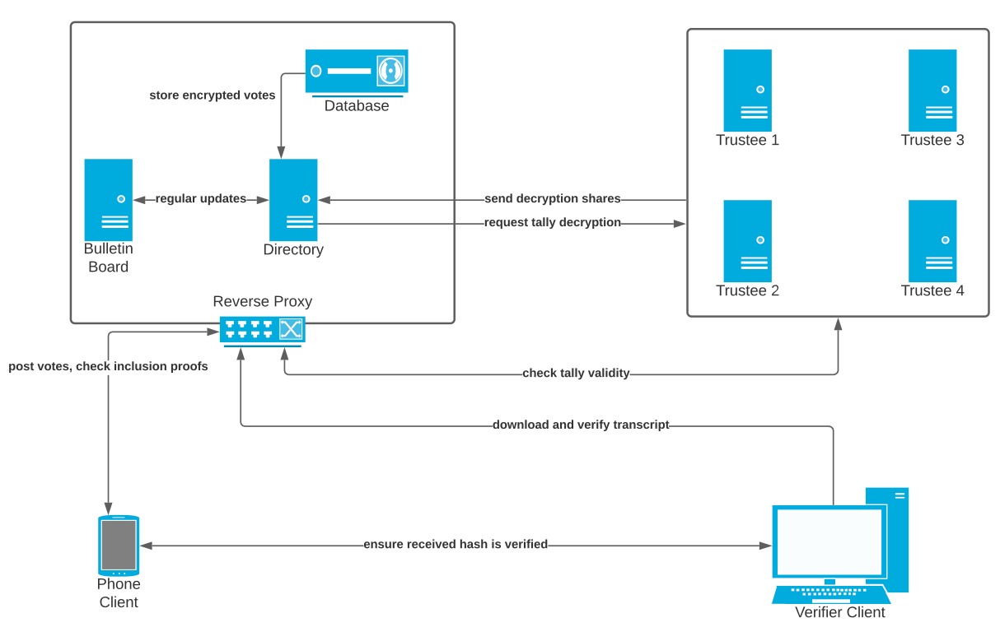

# API

## Overview

This document aims to initiate discussion regarding the APIs and data objects from a level of abstraction without diving into details. All analysis closely follows the [feature documentation](https://righttoaskorg.github.io/righttoask-docs/Features) such that all desired features are achievable using the API deisgn listed on this page. 

This document currently only discuss the communication between the phone client and the directory as shown in diagram below. The directory handels all the GET and POST request from the client who can be either a MP or a member of the public. Direct messaging isn't a must have requirement and would be discussed in the future.

[API.md](https://github.com/RightToAskOrg/righttoask-docs/blob/gh-pages/API.md) dives deeper into the API for voting and verifying the votes of a question.

We assume that all communicate are encrypted using HTTPS.

## Registeration

A user $(Pu, Pr,phone, email)$ register him or herself by submitting  $(Pu, phone)$ to the server. The server then sends a $pin$ to the number provided. Upon receving the $pin$ the user submits $(Pu, pin)$ to prove and associate the public key with the phone number. Now the user can use the private key $Pr$ to sign all communications to server. The same could be done for email address, especailly for emails of government domain to verify the status of a government worker.

The association $(Pu, phone, email)$ is stored on the server. To increase privacy, the email and phone number is stored as hashes. To ensure annomity, a digital mail box is used to store votes, where we only read the content of the messages when the association between $(Pu, content)$ is broken. To deter spamming and indencency, the posting of content isn't annoymous. 

## Syncing of data

What better way to hide your viewing history than storing the entire copy of the database? This approach is achievable thanks to wordlimits imposed on the questions, and the use of links to external multimedia. An attack that sniffs the traffic to external links is beyond the scope of this system.

Verification is only required for the viewing of data concerning user's personal details.

## Push notification

In order to reserve the privacy provided by the syncing entire database, a server can only prompt the client to sync in the events of the addition of new answers and other non-specific events. The client then initates a sync request, and decides what notifications to display on device based on locally stored user preferences such as subscriptions to certain tags.

Exceptions to the above rule are the event regarding a user's question because we don't annoymise the creation of questions.

## Data analysis

Because each client's device contains a synchronized copy of the server's database, all data processing and visualization can be done locally. 

An important question is whether we supply more information to the MPs. For example, MPs can identity their electorates using users' phone number and email address, on the other thand, such information would be of no use to the general public.

## API implementation guidlines

* Each URI must preceed with a version number to allow backward compatability and to give time for users to update the application. E.g. `GET v2/uri`.
* API should not depend parameters that will expose the identity of the user. 
* Write all URIs using lowercase proper English with subfolder like structures to associate similar URIs. For example `POST verify/mp` and `POST verify/user`.
* Preference POST over DELET. A version history perserves non-repudiation.

